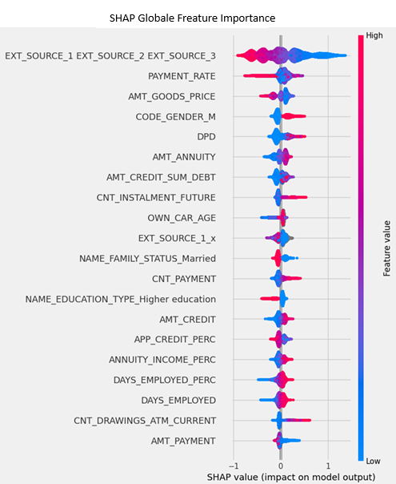

# 🏦 Scoring Crédit — Modèle de risque de défaut & API REST


Projet de Data Science réalisé dans le cadre de la formation OpenClassrooms.

## 🎯 Objectif

Développer un modèle de **scoring crédit** capable d'estimer la probabilité de défaut de remboursement d'un client, puis le déployer sous forme d'**API REST** consommable par une application tierce.

Les données utilisées proviennent du challenge Kaggle [Home Credit Default Risk](https://www.kaggle.com/c/home-credit-default-risk).

---

## 🔍 Démarche

1. **Exploration et préparation des données** — analyse des déséquilibres de classes, feature engineering, gestion des valeurs manquantes
2. **Entraînement et comparaison de modèles** — Régression Logistique, Random Forest, LightGBM/XGBoost
3. **Optimisation métier** — définition d'une fonction de coût personnalisée (coût différencié faux positif / faux négatif)
4. **Tracking des expériences** — suivi des runs, paramètres et métriques avec **MLFlow**, enregistrement du modèle final dans le Model Registry
5. **Explicabilité** — analyse de la feature importance globale et locale avec **SHAP**
6. **Surveillance** — détection de data drift avec **Evidently AI**
7. **Déploiement** — exposition du modèle via une API REST déployée sur Heroku

---

## 📊 Performances du modèle retenu

| Métrique            | Score      |
| ------------------- | ---------- |
| ROC AUC             | 0.709      |
| Recall              | 0.691      |
| F1 Score            | 0.287      |
| Precision           | 0.181      |
| Score métier custom | 46 223 000 |

> **Note sur le score métier** : la fonction de coût pénalise davantage les faux négatifs (défauts non détectés) que les faux positifs (bons clients refusés), reflétant le risque financier réel de l'établissement. Le modèle a été optimisé sur ce critère plutôt que sur l'accuracy brute.

> **Note sur le Recall élevé** : le recall de 0.691 est volontairement privilégié pour maximiser la détection des défauts, au détriment de la précision — choix justifié par la fonction de coût métier.

---

## 🧠 Explicabilité avec SHAP

Analyse de l'impact de chaque variable sur les prédictions du modèle :

- **Feature importance globale** : identification des variables les plus influentes sur l'ensemble du dataset
- **Explications locales** : pour chaque client, visualisation des variables qui ont poussé le score à la hausse ou à la baisse



---

## 📉 Surveillance du Data Drift — Evidently

Analyse de la stabilité du modèle en conditions réelles via **Evidently AI** :

- Comparaison de la distribution des features entre les données d'entraînement et de production
- Génération d'un **rapport HTML interactif** (`HTML_DataDrift_Evidently.html`) visualisant les dérives détectées variable par variable
- Identification des variables les plus susceptibles de dégrader les performances du modèle dans le temps

> Cette étape simule une démarche MLOps : un modèle déployé doit être surveillé pour détecter toute dérive des données d'entrée pouvant altérer la qualité des prédictions.

---

## 🚀 API REST

Le modèle est exposé via une **API REST Flask** permettant de soumettre les caractéristiques d'un client et d'obtenir en retour son score de risque.

- Déployée sur **Heroku** _(désactivée)_
- Consommée par le dashboard interactif du [Projet 8](https://github.com/Heneault-IA/Projects/tree/main/Project%208)

---

## 🛠️ Stack technique

- **Python** — Pandas, NumPy, Scikit-learn
- **Modèles** — Régression Logistique, Random Forest, LightGBM, XGBoost
- **Explicabilité** — SHAP
- **API** — Flask, REST
- **Déploiement** — Heroku
- **Tracking & registry** — MLFlow (suivi des expériences, enregistrement du modèle)
- **Monitoring** — Evidently AI (data drift)
- **Environnement** — Jupyter Notebook

---

## 📂 Structure du projet

```
Project 7/
├── img/
│   └── Shap.png
├── notebooks/
│   ├── img_tmp/
│   ├── Scoring_Model.ipynb
│   ├── Notebool_Evidently.ipynb
│   └── HTML_DataDrift_Evidently.html
├── api/
│   ├──  model/
│       ├──  conda.yaml
│       ├──  model.pkl
│       ├──  MLmodel
│       └──  python_env.yaml
│   ├── templates/
│       ├──  index.html
│       └──  results.html
│   ├── API.py
│   ├── fonction.py
│   ├── Procfile
│   └── sample_data.csv
├── Project_presentation.pptx
├── requirements.txt
└── README.md
```

> ⚠️ La structure ci-dessus est indicative — adapter selon le contenu réel du dossier.

---

## 🔗 Liens

- [Projet 8 — Dashboard interactif](https://github.com/Heneault-IA/Projects/tree/main/Project%208)
- [Retour au portfolio](https://github.com/Heneault-IA/Projects)
